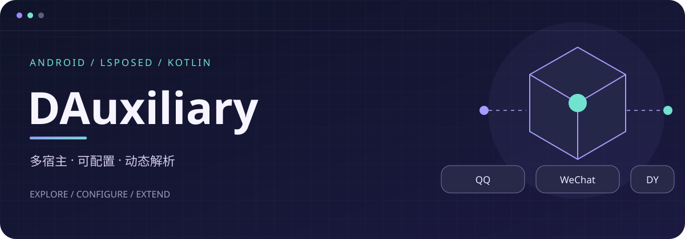
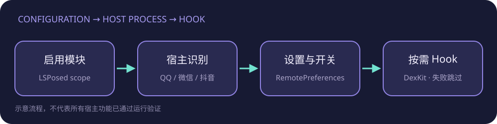

<p align="center">
  
</p>

<p align="center">
  <a href="https://developer.android.com/"></a>
  <a href="https://kotlinlang.org/"></a>
  <a href="https://github.com/LSPosed/LSPosed"></a>
  <a href="https://github.com/NHXXHNWAN/DAuxiliary/tree/Test"></a>
</p>

# DAuxiliary

DAuxiliary 是一个面向 Android 宿主应用的 LSPosed 模块，使用 Kotlin、Jetpack Compose、Miuix 和现代 LibXposed API 构建。模块负责在宿主进程中按需加载独立功能，并提供宿主内设置入口。

> 当前开发目标是多宿主架构。抖音、微信和 QQ 已纳入宿主分发；具体功能仍以代码状态和真机验证结果为准。未经 QQ/LSPosed 真机验证的功能不会标记为稳定支持。

<p align="center">
  
</p>

## 核心特性

- **多宿主分发**：统一识别抖音、微信和 QQ，并按宿主隔离配置。
- **LibXposed API 102**：使用现代模块生命周期和远程配置，不依赖旧式 Xposed API。
- **Miuix 设置界面**：宿主内设置入口使用轻量 Compose 页面和 Miuix 组件。
- **QQNT 撤回拦截**：独立 Hook QQNT `onMsfPush`，通过 Protobuf 消息类型识别撤回推送；实验性，尚待真机验证。
- **安全降级**：目标无法可靠定位时记录原因并跳过，不阻塞宿主启动。
- **配置持久化**：模块进程保存配置，宿主进程通过 LibXposed remote preferences 读取。

## 功能状态

| 宿主 | 功能 | 状态 | 说明 |
| --- | --- | --- | --- |
| 抖音 / 微信 / QQ | 宿主内模块设置入口 | 已实现，待广泛真机验证 | QQ 使用设置页注入与视图回退；其他宿主使用轻量入口 |
| QQ | 防撤回 | 实验性，待真机验证 | 已实现 QQNT `onMsfPush` 系统推送 Hook，并按 Protobuf ContentHead 类型过滤私聊/群聊撤回；未解析到的消息仍走 QQ 原流程 |
| 抖音 / 微信 | 具体功能 Hook | 开发中 | 当前仓库没有可宣称稳定支持的具体功能 |

### QQ 防撤回边界

QQ 防撤回实现采用独立开关与 QQNT 系统推送 Hook：当功能开启时，模块尝试定位 `IQQNTWrapperSession$CppProxy.onMsfPush`，只处理命令字 `trpc.msg.olpush.OlPushService.MsgPush`，并解析 Protobuf `MsgPush → Message → ContentHead`。命中 C2C 撤回（`type=528, subType=138`）或群撤回（`type=732, subType=17`）时阻断该撤回推送，避免 QQ 后续按此推送删除本地消息；其他推送、未知结构及解析失败均放行原始逻辑。

该路径依据 QAuxiliary 开源实现及其 Protobuf 定义设计，仍属实验性实现，尚未在目标 QQ 版本与 LSPosed 真机环境验证。Hook 方法签名、推送行为和返回/拦截语义可能随 QQ 版本变化；请先在测试账号和测试环境验证，不宣称稳定支持。

<p align="center">
  
</p>

## 支持宿主与兼容性

| 宿主 | 包名 | 当前定位 |
| --- | --- | --- |
| 抖音 | `com.ss.android.ugc.aweme` | 已接入宿主入口框架 |
| 微信 | `com.tencent.mm` | 已接入宿主入口框架 |
| QQ | `com.tencent.mobileqq` | 以 QQ 9.3.60 为分析基线，设置入口已提供安全回退 |

兼容性不只取决于版本号，还取决于宿主进程、混淆结果、ROM 和 LSPosed 版本。无法定位目标时模块应自动跳过；“开关开启”不等于“Hook 成功”。

<p align="center">
  
</p>

## 安装与启用

1. 使用 JDK 17 环境构建或从 GitHub Actions 获取测试 APK。
2. 在已安装 LSPosed 的测试设备上安装 DAuxiliary。
3. 在 LSPosed 中启用模块，并将作用域限定到需要测试的宿主。
4. 强制停止并重新启动宿主应用。
5. 通过宿主内的 DAuxiliary 入口打开设置页。
6. 只启用已经完成对应版本验证的功能。

QQ 防撤回当前属于实验性功能。若日志显示回调未找到、签名歧义或 Hook 初始化失败，模块会保留 QQ 原始行为；即使 Hook 注册成功，也需要通过私聊与群聊撤回场景验证实际效果。

## 配置与架构

配置文件由模块应用持有，宿主进程只通过 LibXposed remote preferences 读取。功能配置按 `AppTarget` 隔离，避免 QQ、微信和抖音互相污染。

```text
EntryHook
└── AppTarget.fromPackageName()
    └── FeatureRegistry.dispatch()
        ├── HostEntryHook
        │   ├── QQSettingsEntryHook
        │   └── 通用宿主入口
        └── QQRecallHook（仅开关开启时初始化）
            └── onMsfPush 撤回推送识别与拦截
```

每个功能应满足：

- 有独立功能 ID 和开关；
- 关闭时不初始化相关 Hook；
- 安装过程可重复调用且不会重复注册；
- 反射、解析和回调都有异常边界；
- 目标不明确时保留宿主原始行为；
- 日志不输出聊天正文、账号或群组隐私信息。

<p align="center">
  
</p>

## 开发说明

主要目录：

```text
app/src/main/kotlin/com/dauxiliary/
├── core/config/       # 配置与宿主状态
├── core/feature/      # 功能定义与分发
├── core/registry/     # 宿主枚举
├── core/xposed/       # LibXposed 入口、设置入口和 QQ 解析器
└── ui/                # 模块进程与宿主内 Compose/Miuix 页面

docs/assets/           # README 纯 SVG 视觉资源
```

依赖版本集中在 `gradle/libs.versions.toml`。当前 Android `compileSdk` 为 37，最低 Android API 为 33，Java/Kotlin 编译目标为 JDK 17。

本项目开发约束：

- 只在当前工作区修改代码和文档，不直接操作用户设备；
- 不提交 APK、反编译临时文件、设备日志、`local.properties` 或签名材料；
- 不把未经验证的版本写成稳定兼容；
- 不提交 GitHub Token 或其他敏感凭据；
- 目标分支为 `Test`。

## 构建

Linux/macOS：

```bash
chmod +x ./gradlew
./gradlew :app:assembleDebug
```

Windows：

```bat
gradlew.bat :app:assembleDebug
```

Debug APK 输出位置：

```text
app/build/outputs/apk/debug/app-debug.apk
```

Release 签名通过 CI 环境变量提供，仓库不保存 keystore。当前分支的构建和运行效果仍需结合实际环境确认。

## 故障排查

- **宿主内没有入口**：检查 LSPosed 作用域、宿主包名、主进程和模块总开关，然后重启宿主。
- **QQ 设置入口没有出现**：检查 QQ 版本是否接近 9.3.60，并查看 `DAuxiliary` 日志中的 provider/fallback 状态。
- **QQ 防撤回没有效果**：先确认功能开关、QQ 进程重启和 `DAuxiliary` 日志；当前 Hook 属于实验性实现，可能因 QQ 版本、回调签名或推送格式变化而未命中。
- **宿主启动异常**：立即关闭模块或取消对应作用域，并提供完整日志；所有新增 Hook 都应优先保证安全回退。
- **构建失败**：先确认 JDK 17、Android SDK 37 和依赖仓库可用，不要根据超时结果判断构建成功。

## 贡献与许可证

欢迎提交与宿主版本、解析证据和运行日志相关的改进建议。提交日志时请脱敏账号、聊天正文、群名称和设备标识。

当前尚未确定 DAuxiliary 的开源许可证。许可证确定前，不在仓库页面声明项目已按某个许可证发布。第三方参考项目的版权和许可证仍需按其原始要求处理。